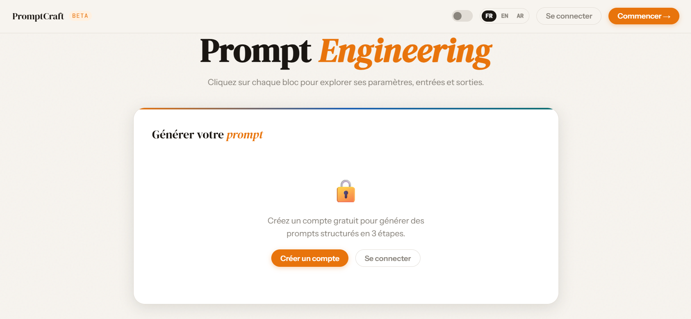
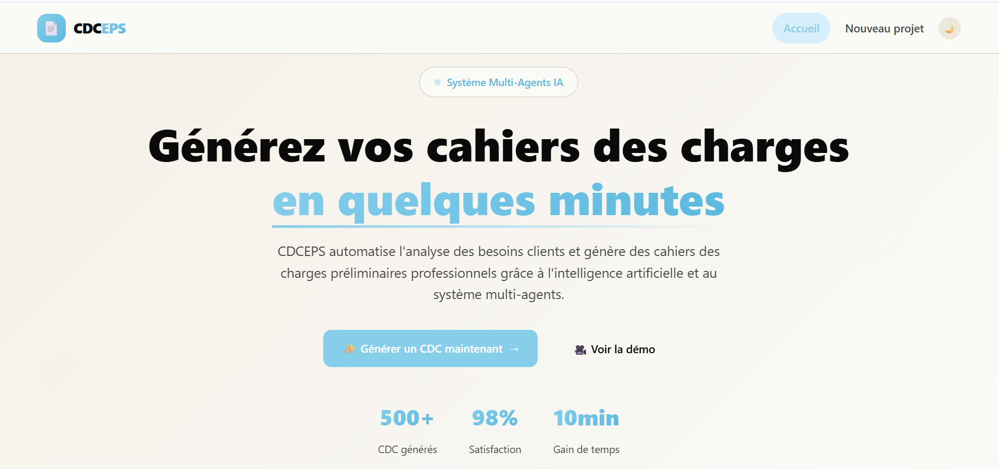
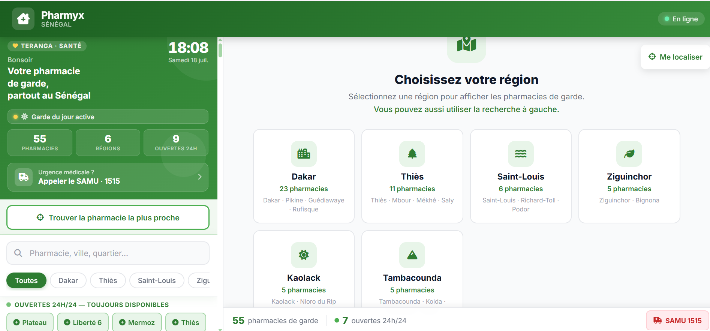
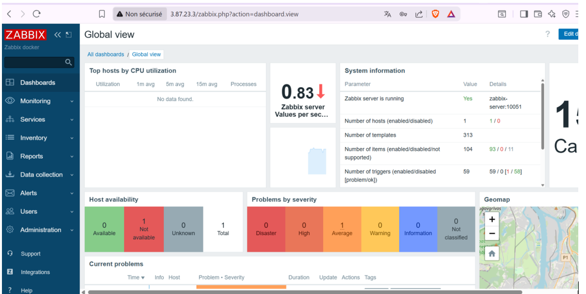
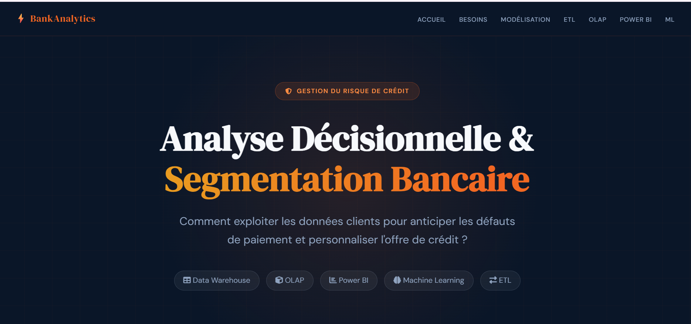

## Hi there 👋

  

<!--
**Ramadiaw12/Ramadiaw12** is a ✨ _special_ ✨ repository because its `README.md` (this file) appears on your GitHub profile.
<!-- Header -->

<!-- Introduction -->

  <h1>👋 Bonjour, je suis Ramatoulaye DIAWANE</h1>
  <h3>AI Infrastructure Engineer</h3>

 

 

<!-- GitHub Snake -->

  <picture>
    <source
      media="(prefers-color-scheme: dark)"
      srcset="https://raw.githubusercontent.com/Ramadiaw12/Ramadiaw12/output/github-contribution-grid-snake-dark.svg"
    />
    <source
      media="(prefers-color-scheme: light)"
      srcset="https://raw.githubusercontent.com/Ramadiaw12/Ramadiaw12/output/github-contribution-grid-snake.svg"
    />
    
  </picture>

<!-- Technologies -->

  <h2>💻 Stack Technique (AI Infrastructure)</h2>

  #### Langages & Frameworks IA
  

  #### MLOps & Cloud
  

  #### Outils de Data & LLM
  

    
    
    
    
    
  

  #### Monitoring & Observabilité
  

<!-- Projects Section -->

  <h2>🚀 Projets Phares en IA</h2>

  <table>
    <tr>
      <td align="center">
        <a href="https://getpromptcraft.org">
           
          <b>Prompting-Tools for prompt AI</b>
        </a>
           AI-powered prompt engineering platform for generating, optimizing.
      </td>
      <td align="center">
        <a href="https://github.com/Ramadiaw12/CDCeps">
           
          <b> AI-Powered Requirements Engineering</b>
        </a>
         
        AI-powered software requirements generation.
      </td>
      <td align="center">
        <a href="https://github.com/Ramadiaw12/pharmyx">
           
          <b>Pharmyx – Smart Pharmacy Locator</b>
        </a>
         Find nearby on-duty pharmacies instantly.
      </td>
    </tr>
    <tr>
      <td align="center">
        <a href="https://github.com/Ramadiaw12/Project_Zabbix_AWS">
           
          <b>CloudOps Monitoring</b>
        </a>
         Monitoring and observability with Zabbix.
      </td>
      <td align="center">
        <a href="https://github.com/Ramadiaw12/BI_project">
           
          <b>Banking Business Intelligence</b>
        </a>
         Credit risk analytics and customer segmentation.
      </td>
      <td align="center">
        <a href="https://github.com/Ramadiaw12/rag_project">
           
          <b>AI Document Assistant</b>
        </a>
         Chat with PDFs using Retrieval-Augmented Generation.
      </td>
    </tr>
  </table>

<!-- Social Media -->

  <h2>🌐 Réseaux Sociaux</h2>

  
  
  
  

  

<!-- Contributions -->

  <h2>🤝 Let's Connect & Collaborate</h2>

  🔍 Explore my AI, Backend & Data Engineering projects 
  🤖 Collaborate on innovative AI and open-source projects 
  💡 Share ideas, feedback, or feature suggestions 
  🌟 If you enjoy my work, don't forget to leave a star!

<!-- Languages -->

  <h2>🌍 Langues</h2>

  
  

<!-- GitHub Stats -->

  <h2>📊 Statistiques GitHub</h2>

<!-- Footer -->

  
🤝 Ouvert aux collaborations en MLOps et infrastructure IA

